# Smart Sort — Korisnički vodič

**Smart Sort** je Shopify aplikacija koja automatski sortira proizvode u Vašim kolekcijama koristeći pametni algoritam koji uzima u obzir vremensku prognozu, sezonske scoreve kategorija, kvote po spolu i pravila diversifikacije.

---

## Sadržaj

1. [Kolekcije](#1-kolekcije)
2. [Kategorije](#2-kategorije)
3. [Opće postavke](#3-opće-postavke)
4. [Postavke kolekcije](#4-postavke-kolekcije)
5. [Raspored](#5-raspored)
6. [Prognoza](#6-prognoza)
7. [Logovi](#7-logovi)
8. [Tipičan workflow](#8-tipičan-workflow)

---

## 1. Kolekcije

U ovom tabu upravljate kolekcijama koje aplikacija prati i automatski sortira.

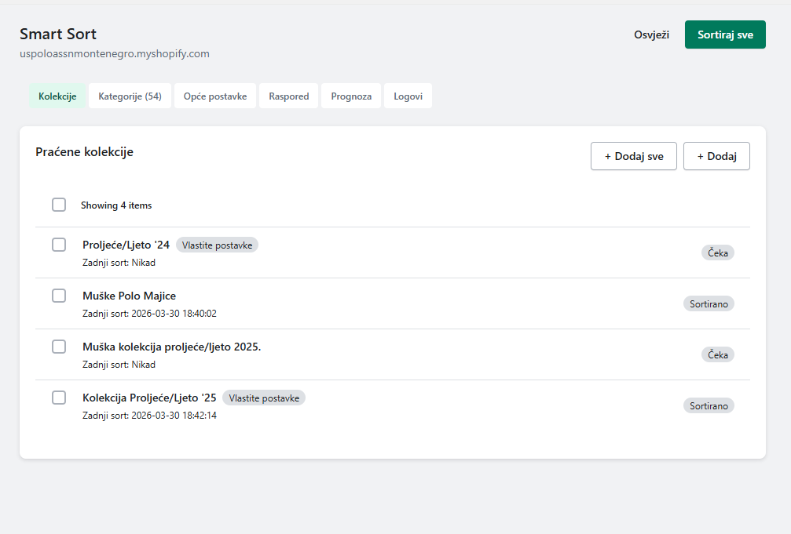

### Dodavanje kolekcija

| Akcija | Opis |
|--------|------|
| **+ Dodaj** | Pretražite i odaberite jednu kolekciju iz padajućeg menija |
| **+ Dodaj sve** | Dodaje sve Shopify kolekcije odjednom (traži potvrdu prije izvršavanja) |

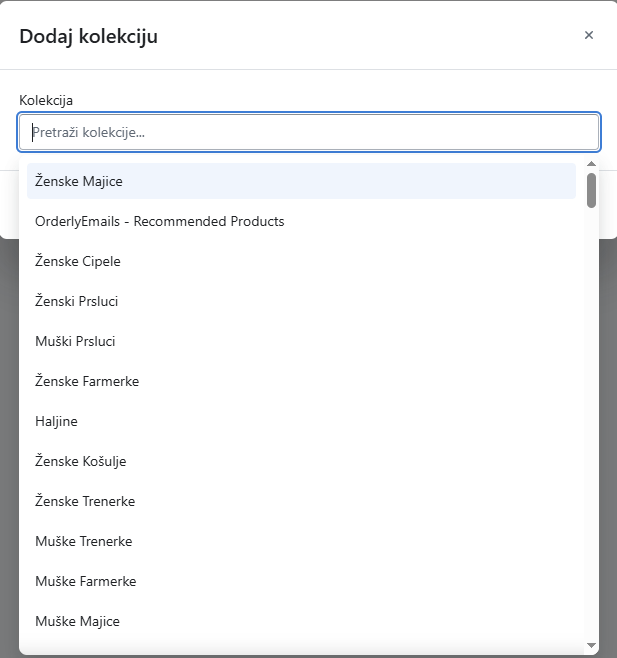

### Akcije za svaku kolekciju

| Dugme | Opis |
|-------|------|
| **Sortiraj** | Pokreće sortiranje odmah i primjenjuje novi redoslijed na Shopifyju |
| **Preview** | Prikazuje kako bi sortiranje izgledalo, bez primjene na stvarnu kolekciju |
| **Postavke** | Otvara vlastite postavke za tu kolekciju |
| **Ukloni** | Uklanja kolekciju iz praćenja (kolekcija ostaje na Shopifyju) |

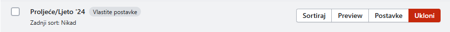

### Statusni bedževi

| Bedž | Značenje |
|------|----------|
| **Vlastite postavke** | Kolekcija ima vlastiti config koji se razlikuje od općih postavki |
| **Sortirano** | Kolekcija je barem jednom bila sortirana |
| **Čeka** | Kolekcija još nije bila sortirana |

### Preview sortiranja

U Preview modalu vidite prijedlog novog redoslijeda **bez primjene** na Shopify:

- Aktuelni temperaturni rang koji se koristi (Cold / Mild / Warm / Hot)
- Ukupan broj proizvoda
- Predloženi redoslijed s pozicijom, nazivom, kategorijom, tipom i scoreom
- Straničenje (24 proizvoda po stranici)

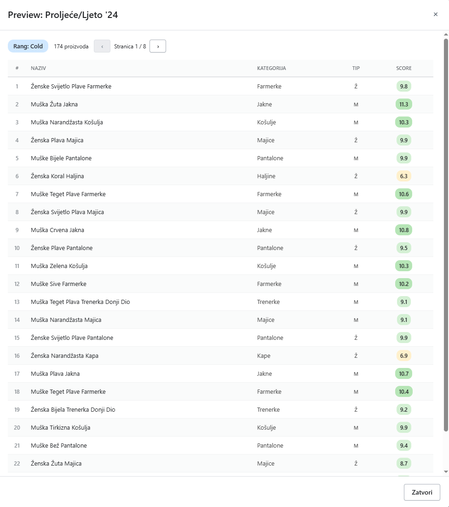

---

## 2. Kategorije

Ovdje definirate **sezonski score** za svaku kategoriju proizvoda i označavate **sprinklere**.

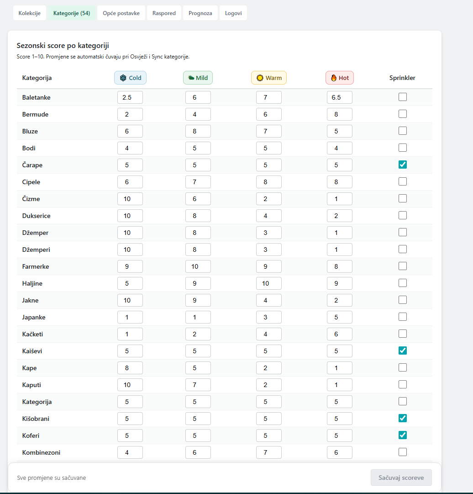

### Sezonski scorevi (1–10)

Svaka kategorija dobiva score za svaki temperaturni rang. Kategorija s višim scoreom za aktuelni rang dolazi na bolje pozicije u kolekciji.

| Rang | Simbol | Temperaturni raspon |
|------|--------|---------------------|
| Cold | ❄️ | do 10 °C |
| Mild | 🌤 | 11 °C – 20 °C |
| Warm | ☀️ | 21 °C – 28 °C |
| Hot | 🔥 | 29 °C i više |

**Primjer:** Jakne s Cold = 10 i Hot = 1 bit će na vrhu kolekcije zimi, a na dnu ljeti.

> **Napomena:** Pri dodjeljivanju scoreva uzmite u obzir i relevantnost kategorije, ne samo sezonsku prikladnost. Score treba odražavati koliko je kategorija zanimljiva i tražena u datom trenutku — nije dovoljno da je sezonski prikladna ako je kupci rijetko aktivno traže.

### Sprinkler kategorije

Kategorije označene kao **Sprinkler** (npr. Torbe, Ruksaci, Čarape) tretiraju se kao akcesori — ubacuju se između glavnih proizvoda po posebnom redoslijedu i **ne natječu se** za redovne kvotne pozicije.

---

## 3. Opće postavke

Default postavke koje vrijede za **sve kolekcije**, osim onih koje imaju vlastite postavke.

### Kvote po stranici

Definirate koliko proizvoda svakog tipa se prikazuje po jednoj stranici kolekcije.

> **Ukupan zbroj mora biti tačno 24.**

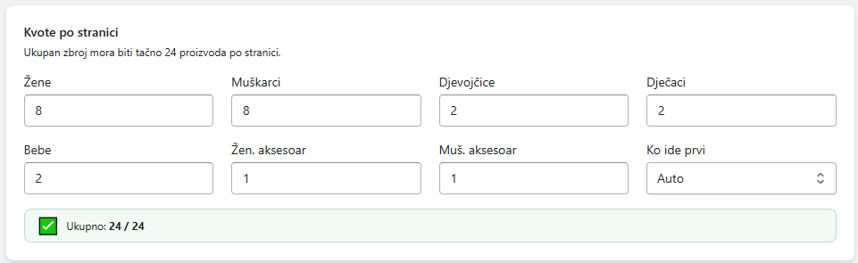

| Polje | Opis |
|-------|------|
| **Žene** | Broj ženskih proizvoda po stranici |
| **Muškarci** | Broj muških proizvoda po stranici |
| **Djevojčice** | Broj proizvoda za djevojčice |
| **Dječaci** | Broj proizvoda za dječake |
| **Bebe** | Broj proizvoda za bebe |
| **Žen. aksesoar** | Broj ženskih aksesora (sprinkler kategorije) |
| **Muš. aksesoar** | Broj muških aksesora (sprinkler kategorije) |
| **Ko ide prvi** | **Auto** (naizmjenično), **Žene** ili **Muškarci** |

### Penali diversifikacije

Sprječavaju da ista kategorija, boja ili tip budu na uzastopnim pozicijama. Što je veća vrijednost, manja je šansa da se isti atribut pojavi u blizini.

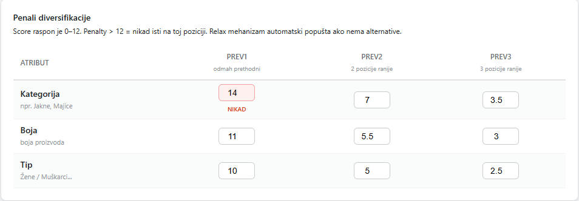

- **Vrijednost > 12** — ta kombinacija se nikad ne pojavljuje na toj poziciji
- **Relax mehanizam** — ako nema alternative, penali se automatski smanjuju dok se ne pronađe rješenje

### Zabranjene kategorije

Kategorije koje se **ne pojavljuju na prvoj stranici** (defaultno prvih 24 pozicije). Korisno za kategorije poput Setovi ili Potkošulje koje ne trebaju biti istaknute.

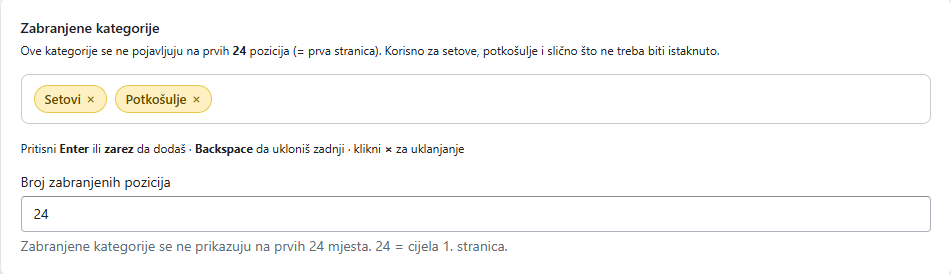

Unesite naziv kategorije i pritisnite **Enter** ili **zarez**. Kliknite **×** pored naziva da uklonite kategoriju.

### Prioritet aksesoara

Redoslijed kojim se sprinkler kategorije ubacuju između glavnih proizvoda. Kategorije na vrhu liste imaju prednost.

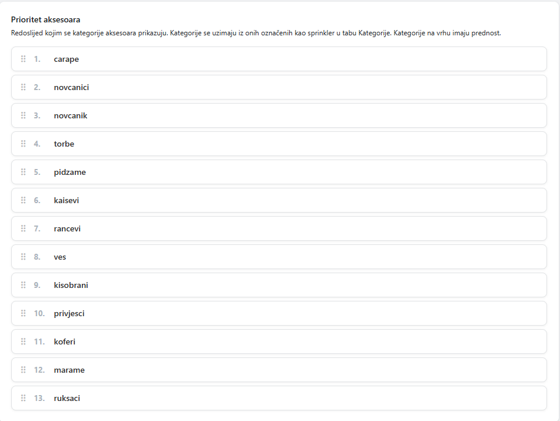

### Fallback redoslijed

Kada nema dovoljno proizvoda određenog tipa, algoritam uzima sljedeći tip iz definiranog lanca.

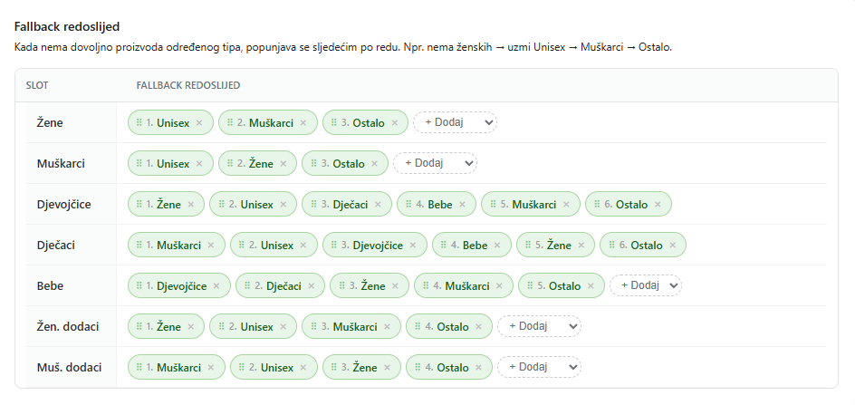

**Primjer:** Žene → Unisex → Muškarci → Ostalo
Ako nema dovoljno ženskih proizvoda za popuniti kvotu, uzimaju se Unisex, pa Muški, pa Ostalo.

### Fino podešavanje algoritma

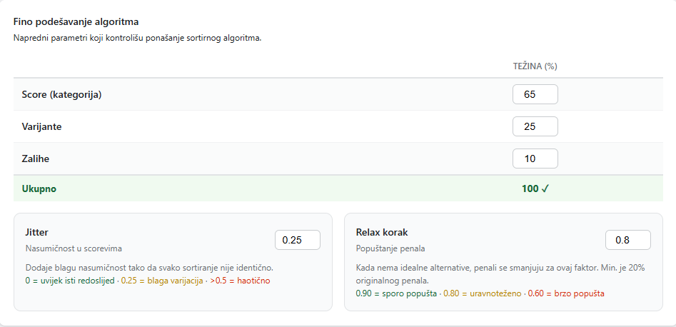

| Parametar | Opis |
|-----------|------|
| **Težina — Score (kategorija)** | Koliko sezonski score kategorije utječe na finalnu poziciju (%) |
| **Težina — Varijante** | Koliko broj varijanti utječe na poziciju (%) |
| **Težina — Zalihe** | Koliko količina zaliha utječe na poziciju (%) |
| | *Suma sva tri mora biti tačno 100 %* |
| **Jitter** | Nasumičnost: 0 = uvijek isti redoslijed · 0.25 = blaga varijacija · > 0.5 = haotično |
| **Relax korak** | Brzina popuštanja penala: 0.90 = sporo · 0.80 = uravnoteženo · 0.60 = brzo |

---

## 4. Postavke kolekcije

Svaka kolekcija može imati **vlastite postavke** koje nadjačavaju Opće postavke samo za tu kolekciju. Sve ostale kolekcije i dalje koriste Opće postavke.

Otvorite ih klikom na **Postavke** pored naziva kolekcije. Forma je identična Općim postavkama.

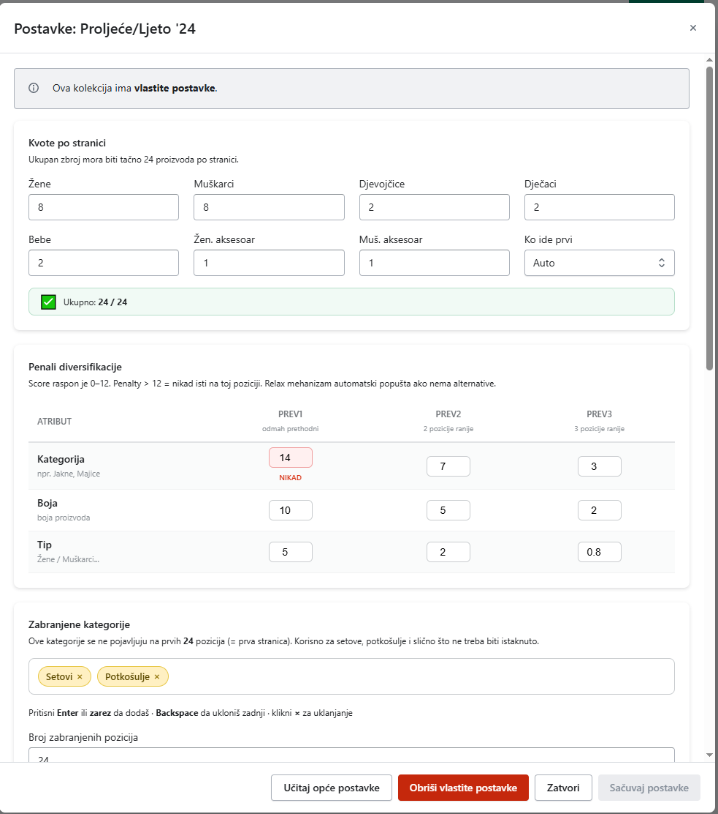

### Dugmad u footeru modala

| Dugme | Opis |
|-------|------|
| **Sačuvaj postavke** | Čuva promjene i primjenjuje ih za ovu kolekciju |
| **Vrati na opće postavke** | Briše vlastite postavke — kolekcija se vraća na Opće postavke. Pojavljuje se samo ako kolekcija već ima vlastite postavke, uz potvrdu prije brisanja. |
| **Zatvori** | Zatvara modal bez čuvanja |

---

## 5. Raspored

Automatsko sortiranje bez ručnog pokretanja.

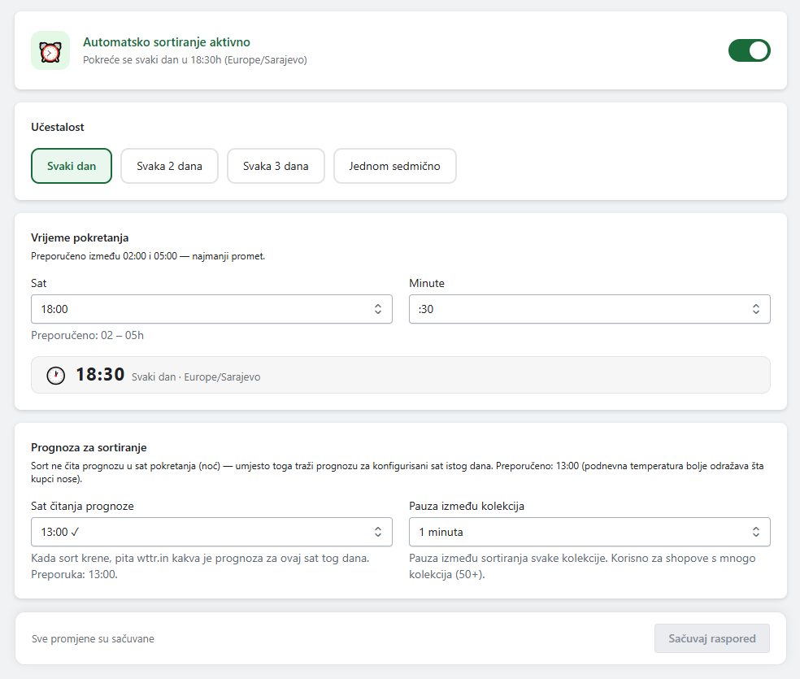

| Polje | Opis |
|-------|------|
| **Omogući raspored** | Uključuje ili isključuje automatsko sortiranje |
| **Interval** | Svakih N dana pokreće sortiranje svih praćenih kolekcija |
| **Sat pokretanja** | Preporučuje se postaviti na noćni sat (npr. 03:00) kada je promet na shopu najmanji |

---

## 6. Prognoza

Aplikacija čita vremensku prognozu i prilagođava sortiranje aktuelnoj temperaturi.

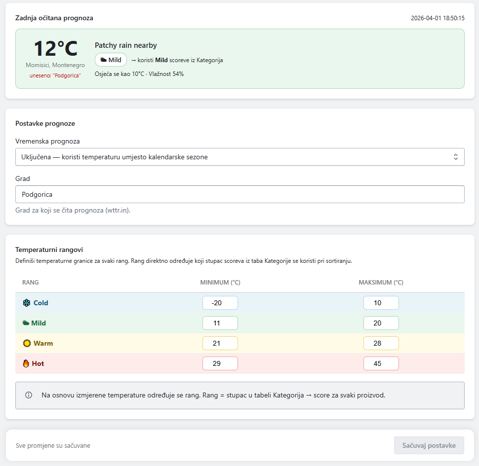

| Polje | Opis |
|-------|------|
| **Grad** | Grad za koji se čita prognoza (npr. Sarajevo) |
| **Sat očitavanja** | Kada se svaki dan automatski čita prognoza |
| **Čitaj prognozu sada** | Ručno čita trenutnu prognozu bez čekanja na zakazani sat |

### Temperaturni rangovi

Tabela u kojoj definirate granice temperature za svaki rang. Rang koji odgovara izmjerenoj temperaturi direktno određuje koji stupac scoreva iz taba **Kategorije** se koristi pri sortiranju.

| Rang | Default raspon | Opis |
|------|----------------|------|
| ❄️ Cold | −20 °C do 10 °C | Zimski asortiman ide na vrh |
| 🌤 Mild | 11 °C do 20 °C | Proljetni / jesenski asortiman |
| ☀️ Warm | 21 °C do 28 °C | Ljetni asortiman |
| 🔥 Hot | 29 °C do 45 °C | Vrući ljetni dani |

Vrijednosti možete prilagoditi prema klimatskim specifičnostima Vašeg tržišta.

> **Napomena:** Ako prognoza nije dostupna, aplikacija automatski koristi **kalendarski fallback**:
>
> | Period | Rang |
> |--------|------|
> | Decembar – Februar | ❄️ Cold |
> | Mart – Maj | 🌤 Mild |
> | Juni – August | 🔥 Hot |
> | Septembar – Novembar | 🌤 Mild |

---

## 7. Logovi

Pregled historije svih sortiranja.

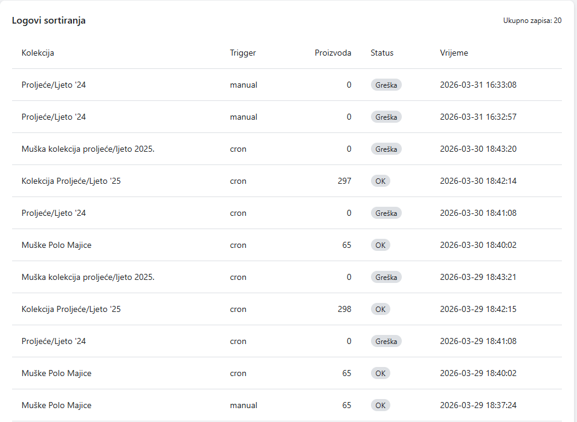

Za svako sortiranje vidite:

| Kolona | Opis |
|--------|------|
| **Kolekcija** | Koja kolekcija je sortirana |
| **Trigger** | `manual` (ručno) ili `cron` (automatski) |
| **Broj proizvoda** | Koliko je proizvoda sortirano |
| **Status** | `OK` (uspješno) ili `Greška` s opisom greške |

---

## 8. Tipičan workflow

Preporučeni redoslijed postavljanja aplikacije:

1. **Dodajte kolekcije** koje želite sortirati *(tab Kolekcije → + Dodaj)*
2. **Podesite kategorije** — unesite sezonske scoreve i označite sprinklere *(tab Kategorije)*
3. **Podesite Opće postavke** — kvote, penali, fallbacki, težine algoritma *(tab Opće postavke)*
4. **Podesite Prognozu** — unesite grad i temperaturne granice, kliknite Čitaj prognozu sada *(tab Prognoza)*
5. **Podesite Raspored** — npr. svaki dan u 03:00 *(tab Raspored)*
6. **Pokrenite prvi sort ručno** — kliknite Sortiraj pored svake kolekcije i provjerite rezultat putem Preview-a

### Vlastite postavke za pojedinačnu kolekciju

Za kolekcije kojima trebaju drugačije postavke od ostalih:

1. Otvorite **Postavke** pored naziva kolekcije
2. Prilagodite željene vrijednosti
3. Kliknite **Sačuvaj postavke**

Da biste kolekciju vratili na opće postavke, kliknite **Vrati na opće postavke** i potvrdite akciju.

---

*Smart Sort — automatsko, pametno sortiranje prilagođeno sezoni i temperaturi.*
